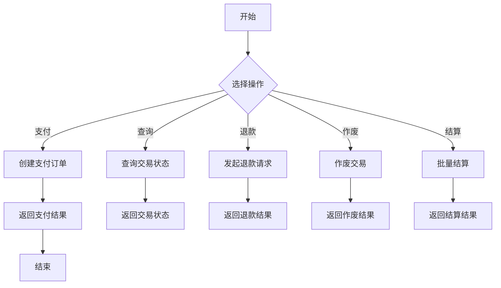

# FOMO-pay - Mobile Payment Integration

FOMO Pay Java SDK provides Spring Boot Starter and demo application for integrating with FOMO payment gateway.

## 安全更新

- 2024-05-01: 升级Spring Boot至3.1.5版本，修复多个安全漏洞
- 2024-05-01: 升级Jackson至2.15.3版本，修复反序列化漏洞
- 2024-05-01: 升级BouncyCastle至1.77版本，修复加密相关漏洞

注意：Spring Boot 3.x需要Java 17或更高版本。如果使用Java 8，请回退到2.7.x版本。

## 项目结构

```
fomopay-spring-boot-starter/  # Spring Boot Starter模块
  ├── src/main/java/com/hejz/
  │   ├── autoconfigure/      # 自动配置类
  │   ├── service/            # 服务接口与实现
  │   └── util/               # 工具类
  └── pom.xml

fomopay-demo/                 # 示例应用
  ├── src/main/java/com/hejz/
  │   ├── controller/         # REST控制器
  │   └── DemoApplication.java # 启动类
  └── pom.xml
```

## 快速开始

1. 添加依赖
```xml
<dependency>
    <groupId>com.hejz</groupId>
    <artifactId>fomopay-spring-boot-starter</artifactId>
    <version>1.0.0</version>
</dependency>
```

2. 配置application.properties
```properties
fomopay.api-key=your_api_key
fomopay.endpoint=https://api.fomopay.com
fomopay.private-key-path=classpath:private_key.pem
fomopay.public-key-path=classpath:public_key.pem
```

3. 使用示例
```java
@Autowired
private FomoPayService fomoPayService;

public void createPayment() {
    PaymentRequest request = new PaymentRequest(0.01, "SGD");
    PaymentResponse response = fomoPayService.createPayment(request);
}
```

## 业务流程



## API 文档

### 支付接口

- 创建支付订单 (Sale Request)
```http
GET /fomopay/transactions/sale?stan=123456&amount=1&description=测试订单
```

响应示例：
```json
{
  "0": "0210",
  "1": "a23840800ac080020000010001000000",
  "3": "000000",
  "7": "1231235959",
  "11": "000001",
  "12": "235959",
  "13": "1231",
  "18": "0005",
  "25": "30",
  "37": "100100120250118273202073",
  "39": "00",
  "41": "10000007",
  "42": "110000000000849",
  "49": "SGD",
  "63": "2816660400949B8M0bKPB7PQf82tDl4v4IP9",
  "88": "000000000001",
  "104": "order #A0000"
}
```

字段说明：
- 0: 消息类型
- 1: 系统跟踪号
- 3: 处理代码
- 7: 交易时间
- 11: 系统跟踪号
- 12: 交易时间
- 13: 交易日期
- 18: 商户类别码
- 25: 服务条件码
- 37: 检索参考号
- 39: 响应码
- 41: 终端号
- 42: 商户号
- 49: 交易币种
- 63: 交易签名（可用于生成二维码）
- 88: 交易金额
- 104: 订单号
```
注意：金额单位为分，最小支付金额为1（即0.01 SGD）

- 查询支付状态 (Query Request)  
```http
GET /fomopay/transactions/{stan}
```

响应示例（支付成功）：
```json
{
  "0": "0110",
  "1": "2220000002c00000",
  "3": "300000",
  "7": "0118153819",
  "11": "000001",
  "39": "00",
  "41": "10000007",
  "42": "110000000000849"
}
```

响应示例（支付失败）：
```json
{
  "0": "0110",
  "1": "2220000002c00000",
  "3": "300000",
  "7": "0118153707",
  "11": "000001",
  "39": "09",
  "41": "10000007",
  "42": "110000000000849"
}
```

字段说明：
- 0: 消息类型
- 1: 系统跟踪号
- 3: 处理代码
- 7: 交易时间
- 11: 系统跟踪号
- 39: 响应码（00=成功，09=失败）
- 41: 终端号
- 42: 商户号

- 处理退款请求 (Refund Request)
```http
PUT /fomopay/transactions?stan=123456&amount=1&retrievalRef=REF123&description=部分退款
```

响应示例（退款成功）：
```json
{
  "0": "0410",
  "1": "a23800000ac000000000008001000100",
  "3": "000000",
  "7": "0118153856",
  "11": "000001",
  "12": "153856",
  "13": "0118",
  "37": "100100120250118273202073",
  "39": "00",
  "41": "10000007",
  "42": "110000000000849",
  "89": "000000000001",
  "104": "Payment Description",
  "120": "{\"payer_id\":\"210220900023576752885\",\"payer_name\":null,\"payer_email\":null}"
}
```

字段说明：
- 0: 消息类型
- 1: 系统跟踪号
- 3: 处理代码
- 7: 交易时间
- 11: 系统跟踪号
- 12: 交易时间
- 13: 交易日期
- 37: 检索参考号
- 39: 响应码（00=成功）
- 41: 终端号
- 42: 商户号
- 89: 交易金额
- 104: 订单描述
- 120: 支付方信息（JSON格式）

- 作废交易 (Void Transaction)
```http
DELETE /fomopay/transactions/{stan}
```

- 提交批次结算 (Batch Settlement)
```http
GET /fomopay/transactions/batch-settlement
```

响应示例：
```json
{
  "0": "0510",
  "1": "a200000002c000000000000000004000",
  "3": "000000",
  "7": "0118151010",
  "39": "00",
  "41": "10000007",
  "42": "110000000000849",
  "114": {
    "batch": "000020",
    "sale": {
      "success": {
        "count": 1,
        "amount": "0.01"
      },
      "fail": {
        "count": 0,
        "amount": "0"
      },
      "void": {
        "count": 0,
        "amount": "0"
      },
      "cancelled": {
        "count": 0,
        "amount": "0"
      },
      "closed": {
        "count": 0,
        "amount": "0"
      }
    },
    "refund": {
      "success": {
        "count": 1,
        "amount": "0.01"
      },
      "fail": {
        "count": 1,
        "amount": "0.01"
      }
    }
  }
}
```

字段说明：
- 0: 消息类型
- 1: 系统跟踪号
- 3: 处理代码
- 7: 交易时间
- 39: 响应码
- 41: 终端号
- 42: 商户号
- 114: 结算详情
  - batch: 批次号
  - sale: 销售交易统计
    - success: 成功交易
    - fail: 失败交易
    - void: 作废交易
    - cancelled: 取消交易
    - closed: 关闭交易
  - refund: 退款交易统计
    - success: 成功退款
    - fail: 失败退款

## 贡献指南

欢迎贡献代码！请遵循以下步骤：

1. Fork 项目
2. 创建特性分支 (`git checkout -b feature/AmazingFeature`)
3. 提交更改 (`git commit -m 'Add some AmazingFeature'`)
4. 推送分支 (`git push origin feature/AmazingFeature`)
5. 创建Pull Request

## 许可证

MIT License
