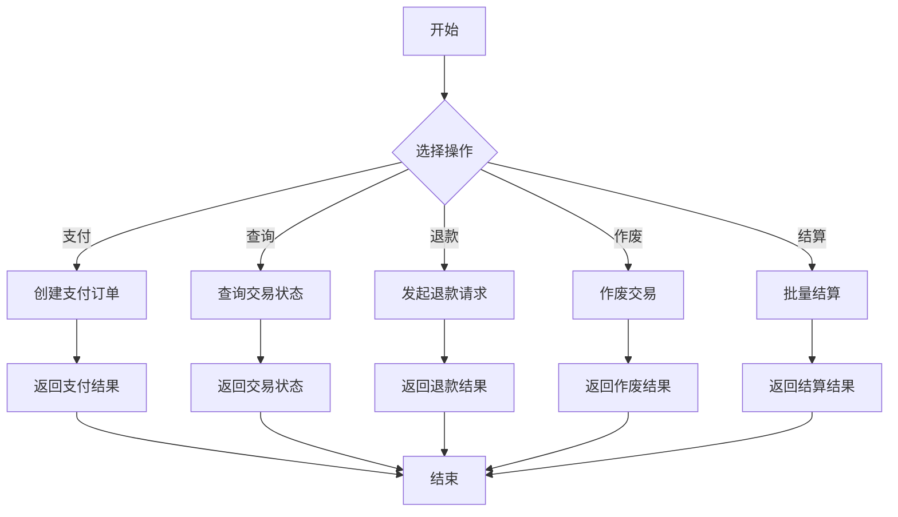

# FOMO Pay - Java SDK

FOMO Pay Java SDK 提供了与FOMO支付网关集成的Spring Boot Starter和示例应用。

## 项目结构

```
fomopay-spring-boot-starter/  # Spring Boot Starter模块
  ├── src/main/java/com/hejz/
  │   ├── autoconfigure/      # 自动配置类
  │   ├── service/            # 服务接口与实现
  │   └── util/               # 工具类
  └── pom.xml

fomopay-demo/                 # 示例应用
  ├── src/main/java/com/hejz/
  │   ├── controller/         # REST控制器
  │   └── DemoApplication.java # 启动类
  └── pom.xml
```

## 快速开始

1. 添加依赖
```xml
<dependency>
    <groupId>com.hejz</groupId>
    <artifactId>fomopay-spring-boot-starter</artifactId>
    <version>1.0.0</version>
</dependency>
```

2. 配置application.properties
```properties
fomopay.api-key=your_api_key
fomopay.endpoint=https://api.fomopay.com
fomopay.private-key-path=classpath:private_key.pem
fomopay.public-key-path=classpath:public_key.pem
```

3. 使用示例
```java
@Autowired
private FomoPayService fomoPayService;

public void createPayment() {
    PaymentRequest request = new PaymentRequest(0.01, "SGD");
    PaymentResponse response = fomoPayService.createPayment(request);
}
```

## 业务流程



## API 文档

### 支付接口

- 创建支付订单 (Sale Request)
```http
GET /fomopay/transactions/sale?stan=123456&amount=1&description=测试订单
```
注意：金额单位为分，最小支付金额为1（即0.01 SGD）

- 查询支付状态 (Query Request)  
```http
GET /fomopay/transactions/{stan}
```

- 处理退款请求 (Refund Request)
```http
PUT /fomopay/transactions?stan=123456&amount=1&retrievalRef=REF123&description=部分退款
```

- 作废交易 (Void Transaction)
```http
DELETE /fomopay/transactions/{stan}
```

- 提交批次结算 (Batch Settlement)
```http
GET /fomopay/transactions/batch-settlement
```

## 贡献指南

欢迎贡献代码！请遵循以下步骤：

1. Fork 项目
2. 创建特性分支 (`git checkout -b feature/AmazingFeature`)
3. 提交更改 (`git commit -m 'Add some AmazingFeature'`)
4. 推送分支 (`git push origin feature/AmazingFeature`)
5. 创建Pull Request

## 许可证

MIT License
